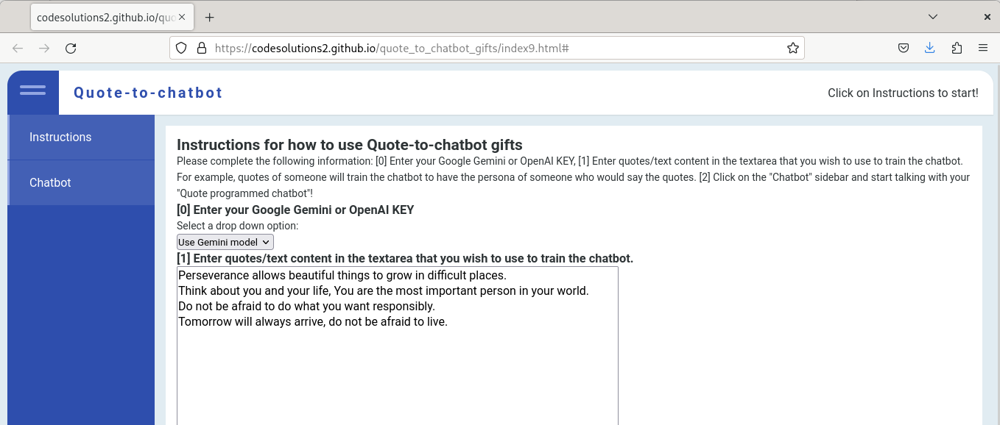
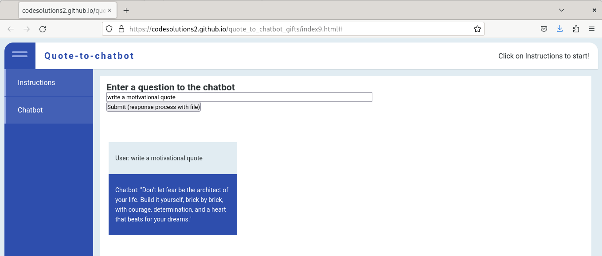

# quote_to_chatbot_gifts

Log quotes or expressions from friends and family and give the gift of talking to "the person"/chatbot you quote! Use different AI models (ie: OpenAI, Gemini, etc) to generate similar ideas/text as the text that you input; improve decision making, improve idea generation, improve writing.

## Instructions for how to use Quote-to-chatbot gifts
Welcome to this "Walk-up-app" where your data is used to make agents similar to the quotes/text content you enter. Please put the following information into the webapp: 

1. Enter your Google Gemini or OpenAI KEY,
2. Enter quotes/text content in the textarea that you wish to use to train the chatbot. The prompt that this chatbot was programmed with is: `You have a personality that embodies the following text quotes: ${text_quotes}. The text quotes are things that your persona would say and know. Using your persona, respond to the following question: ${Q_or_statement})` 
3. Click on the "Chatbot" sidebar and start talking with your "Quote programmed chatbot"!

## Examples

### Example 0: Generating motivational quotes help
For instance, if you need help writing motivational quotes, input some quotes that you already wrote and then ask the chatbot to write some quotes. Simplisticly, the chatbot will use your text quotes as a guide to write more, as if you had written it. 
#### Input quotes/text 

#### Gemini text response 

### Example 1: Decision-making problem solving help
As another example, if you need to solve a decision-making problem write text about past problems and solutions that you used to solve the problems; ask the chatbot to give you solutions to your new problem. The chatbot will use your text as a guide to answer how to solve your new problem, as if you might have solved it.

## Best working version 
This version works uses simple REST API commands to each model, no user data is stored/saved.
[Working version using several AI professional models] https://codesolutions2.github.io/quote_to_chatbot_gifts/index9.html#

## In progress
- Measure/quanitfy similarity of original input text and chatbot generated text
- Quote/input text augmentation - understand how input text quantify influences chatbot generated text
- Custom fine-tuning model
